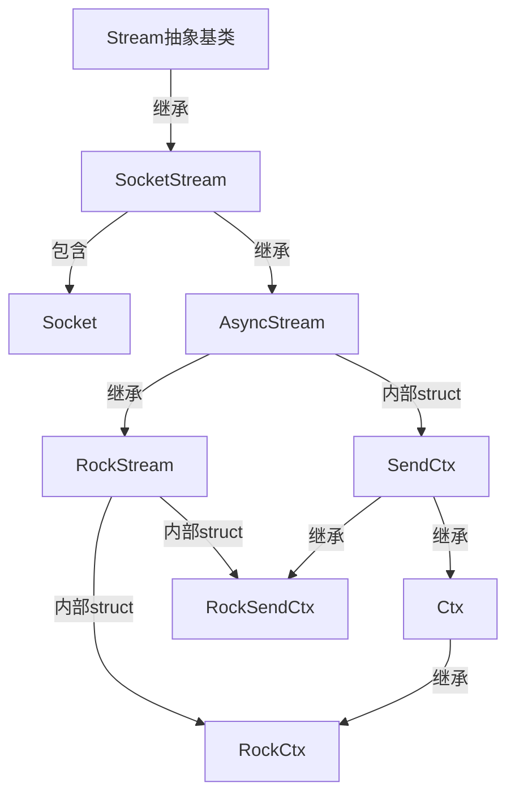
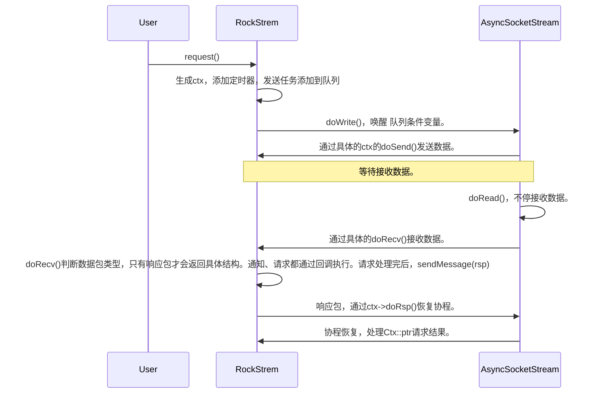

# 基础代码 非重点
## 日志库
> src/base/log/log/ 文件夹

[【sylar-webserver】1 日志系统](https://juejin.cn/post/7564625134575026185)

## 配置库
> src/base/conf/config/ 文件夹

[【sylar-webserver】2 配置系统](https://juejin.cn/post/7564597313465778202)


# 协程库 
> src/base/coro/ 文件夹
协程库是整个系统的核心，提供了高性能的并发处理能力。它基于Linux的epoll机制，实现了事件驱动的协程调度模型。

## fiber（多种协程实现）
协程是轻量级的执行单元，比线程更轻量且切换开销更小。系统支持多种协程上下文实现：
- **ucontext**: 基于系统ucontext的实现
- **fcontext**: 基于boost.context的实现 （默认）
- **libaco**: 基于libaco库的实现
- **libco**: 基于libco库的实现

协程核心类Fiber提供了协程的创建、切换、销毁等功能。通过工厂函数NewFiber/FreeFiber管理协程生命周期，支持协程的复用以减少内存分配开销。

### 协程实现机制 （有栈协程）⭐
从根本上说，一个“协程”的完整状态由两部分组成：
1. CPU 寄存器状态：
    - 指令指针 (IP)：程序“执行到哪里了”（例如 rip on x86-64）。
    - 栈指针 (SP)：当前栈顶在哪里（例如 rsp on x86-64）。
    - 通用寄存器：用于计算、传递参数等（例如 rax, rbx, rdi, rsi, r12-r15 等）。
    - （可能还包括浮点/SIMD寄存器等）。

2. 栈 (Stack) 内存：
    - 函数调用的局部变量。
    - 函数参数。
    - 函数返回地址。

协程切换（Context Switch） 的本质就是：保存当前协程的（1）CPU寄存器状态 和（2）栈内存，然后 加载 目标协程的（1）CPU寄存器状态 和（2）栈内存。

#### Stackful 独立栈

1. 建 (Create)：创建一个新协程时，从堆（malloc）或内存池中分配一块 独立的、连续的 内存块（例如 128KB 或 2MB）作为该协程的私有栈。
2. 切换 (Switch)：当协程A yield 给协程B时：
    - 保存 A：汇编代码将协程A的当前所有寄存器（rip, rsp, rbx...）保存到协程A的 上下文结构体 中（或者直接**保存在它自己的栈顶**）。rsp 的值会指向它私有栈的某个位置。
    - 加载 B：汇编代码从协程B的上下文结构体中，加载它 之前 保存的所有寄存器。
    - 关键点：rsp 寄存器被恢复为指向协程B的 私有栈。
    - 跳转：最后通过 jmp 或 ret 指令，跳转到协程B之前保存的 rip 位置。
```
(高地址)
+-------------------+
|   主协程 (main) 栈 |
+-------------------+
| ... (其他内存) ... |
+-------------------+  <-- Coroutine 1 的 rsp 指向这里
| Coroutine 1 栈   |
| (私有, 128KB)     |
+-------------------+
| ... (其他内存) ... |
+-------------------+  <-- Coroutine 2 的 rsp 指向这里
| Coroutine 2 栈   |
| (私有, 128KB)     |
+-------------------+
(低地址)
```

#### Stack-Copying 共享栈
1. 创建 (Create)：创建一个新协程时，不 分配私有栈。只分配一个很小的上下文结构体，并在其中包含一个 栈保存缓冲区 (save_stack)。
2. 全局共享栈：系统（通常是每个线程）维护一个（或多个）大的 共享栈区（例如 2MB）。
3. 恢复 (Resume) 协程 B：
    - (当前在主协程栈上)
    - 拷贝入：将协程B的 save_stack 里的内容，memcpy 拷贝到 全局共享栈的 栈顶。
    - 切换：执行汇编切换。保存主协程的寄存器，加载协程B的寄存器。
    - 关键点：加载的 rsp 指针将指向 共享栈（我们刚拷贝进去的数据的顶部）。
    - 跳转：跳转到协程B的 rip，协程B开始在 共享栈 上运行。
4. 切出 (Yield) 协程 B：
    - (当前在共享栈上运行)
    - 计算大小：计算协程B 实际使用 的栈大小（从它在共享栈的基址到当前的 rsp）。
    - 拷贝出：将这部分 实际使用 的栈数据，memcpy 拷贝回 协程B的 save_stack 缓冲区中。
    - 切换：执行汇编切换。保存协程B的寄存器（保存到B的上下文结构体中），加载主协程的寄存器。
    - 跳转：返回主协程。共享栈此时被“释放”，可供下一个协程使用。
```
(高地址)
+-------------------+
|   主协程 (main) 栈 |
+-------------------+
| ... (其他内存) ... |
+-------------------+
|  共享栈 (2MB)     |  <-- 任何"当前"运行的协程都在这里执行
+-------------------+

// 非运行状态的协程，
Coroutine 1: [Ctx] [SaveStack (保存了 4KB 的栈数据)]
Coroutine 2: [Ctx] [SaveStack (保存了 8KB 的栈数据)]
```

### 汇编实现 ⭐
根据 x86-64 (System V AMD64 ABI) 调用约定，寄存器分为两类：
- 调用者保存 (Caller-saved)：rax累加, rcx计数, rdx数据, rsi源变址, rdi目标变址, r8-r11通用寄存器。如果函数A调用函数B，函数A 必须自己保存这些寄存器的值，因为函数B可以随意修改它们。
    - 对于函数A 调用者，调用 函数B，需要保存 环境寄存器（例如 rax, rcx, rdx...），因为函数B可以随意修改它们。
    - 对于函数B 被调用者，不需要 保存/恢复
- 被调用者保存 (Callee-saved)：rbx基址寄存器, rbp栈基指针, r12-r15。如果函数B要使用这些寄存器，B 必须在返回A之前，把它们恢复成进入B时的样子。
    - 对于函数A 调用者，同样调用 函数B，不需要 保存/恢复 这些寄存器。
    - 对于函数B 被调用者, 对于 rbx, rbp, r12-r15 这些寄存器，需要 保存/恢复 它们。


### fcontext ⭐
- 高度优化的 ABI 遵从者。
- 只保存“被调用者保存”(Callee-saved) 的寄存器（rbx, rbp, r12-r15）以及 rsp栈指针 和 rip指令指针。
- 当你从 main 切换到 co 时，编译器（main 的视角）会认为它在调用 jump_fcontext。作为 调用者，**编译器已经有责任保存它关心的“调用者保存”寄存器（rax, rcx...）。**  
- jump_fcontext 只需要扮演 被调用者 的角色，因此它只保存“被调用者保存”的寄存器。
- FPU/SIMD：fcontext 提供了 preserve_fpu 选项。默认 不保存 FPU/SIMD 寄存器（xmm, ymm 等），因为它们非常大，保存开销高。如果协程中不用浮点/SIMD运算，这个优化非常显著。

### libco
- libco 的汇编 coctx_swap 保存了几乎所有的通用寄存器！包括“调用者保存”的（rax, rcx, rdx...）和“被调用者保存”的（rbx, rbp...）。
- 栈操作：libco 在 C 层面 coctx_make 初始化栈时，会手动在栈上布局，把入口函数地址 (co_proxy) 放在 rip 应该在的位置，然后汇编代码 coctx_swap 第一次切入时，会使用 ret 指令（它会 pop rip）来“弹射”启动协程。


### libaco 
> 强制“共享栈”   
fcontext 的追随者和优化者。
- libaco 的作者深入研究了 fcontext，并采用了 完全相同的策略：只保存“被调用者保存”(Callee-saved) 的寄存器（rbx, rbp, r12-r15）。
- 汇编切换（aco_swap_asm） 本身只负责寄存器交换。而 C 代码在调用汇编 之前 负责 memcpy 拷贝栈（拷贝入共享栈），在汇编返回 之后 负责 memcpy 拷贝栈（从共享栈拷出）。
- FPU/SIMD：libaco 默认 会保存 FPU 寄存器，以确保（例如 printf 或其他库函数）在协程中可以安全使用浮点运算。

### 协程状态 ⭐
```c++
enum State {
    /// 初始化状态
    INIT,
    /// 暂停状态  
    HOLD,
    /// 执行中状态
    EXEC,
    /// 结束状态
    TERM,
    /// 可执行状态
    READY,
    /// 异常状态
    EXCEPT
};
```
> **主要是 INIT EXEC TERM EXCEPT，READY 和 HOLD 状态仅作为保留状态** 

调度器通过状态来决定协程的处理方式：

- READY状态 ：重新加入调度队列
- HOLD状态 ：暂时不调度，等待条件满足
- TERM/EXCEPT状态 ：协程生命周期结束，不再调度
- EXEC状态 ：跳过，避免重复调度

初始化：
1. 主协程 Fiber(), INIT
2. 任务协程 Fiber(cb), EXEC

协程状态变化总是伴随着上下文切换：
1. swapIn() - 从调度协程切换到目标协程：
   - 状态：任意状态 → EXEC
   - 上下文：调度器上下文 → 协程上下文
2. swapOut() - 从协程切换回调度协程：
   - 状态：EXEC → 其他状态（由调用者决定）
   - 上下文：协程上下文 → 调度器上下文


提供给不涉及到scheduler使用，（主协程-任务协程）
- call() 
- back() 

涉及scheduler使用 （主协程-调度协程-任务协程 见下一节）
- swapIn()              协程切换到前台执行，状态会变成EXEC
- YieldToHold()         基本用这个，但是状态其实没有改成HOLD，还是EXEC
- YieldToReady()        基本不用，状态会变成READY


## scheduler（协程调度器）
调度器负责协程的调度执行，支持多线程并发执行协程。核心功能包括：
- 协程任务队列管理
- 多线程调度支持
- 协程状态管理（READY/EXEC/HOLD/TERM等）
- 空闲协程处理 (idle协程，预留idle虚函数)
- 线程池管理

调度器通过run()方法实现主调度循环，处理协程队列中的任务，并在没有任务时执行idle协程。
 
## timer（定时器管理）
定时器管理器提供了高精度的定时功能，支持：
- 单次定时器
- 循环定时器
- 条件定时器
- 定时器取消功能

定时器基于时间轮算法实现，具有O(1)的插入和删除复杂度。

## iomanager（IO管理器）
IO管理器是协程库的核心组件，基于epoll实现异步IO事件处理：
- epoll事件注册与管理
- 文件描述符事件上下文管理
- 事件触发回调处理
- 管道通知机制实现 pipe 唤醒 epoll_wait
- 定时器集成

## fdmanager（文件描述符管理）
文件描述符管理器提供文件句柄的统一管理：
- 文件描述符上下文管理（FdCtx）
- socket类型识别
- 阻塞状态管理
- 读写超时设置
- 单例模式实现

IOManager继承自Scheduler和TimerManager，实现了协程调度和定时器功能。

## hook（系统调用钩子）
系统调用钩子实现了对常用系统调用的拦截和协程化处理：
- sleep/usleep/nanosleep等时间函数 
- socket/connect/accept等网络函数 
- read/write等IO函数 
- fcntl/ioctl等文件操作函数 （把对 fd 的操作，同步到 fd_manager）

通过钩子机制，使阻塞式系统调用变为非阻塞式协程调度，提升并发性能。

## worker（工作线程池）
工作线程池提供了批处理任务调度功能：
- WorkerGroup：批处理任务组
- TimedWorkerGroup：带超时机制的任务组
- WorkerManager：工作线程池管理器

## fox_thread
基于libevent的事件驱动机制，实现了异步IO事件处理，避免协程阻塞。

每个FoxThread都创建一个socket pair，用于线程间通信：
- m_write - 用于其他线程向该线程发送任务通知
- m_read - 该线程监听任务到达的事件
```cpp
void FoxThread::thread_cb() {
    setThis();
    pthread_setname_np(pthread_self(), m_name.substr(0, 15).c_str());
    if(m_initCb) {
        m_initCb(this);
    }
    event_base_loop(m_base, 0);  // 进入事件循环
}
```

每个FoxThread运行一个独立的libevent事件循环：
```cpp
void FoxThread::thread_cb() {
    setThis();
    pthread_setname_np(pthread_self(), m_name.substr(0, 15).c_str());
    if(m_initCb) {
        m_initCb(this);
    }
    event_base_loop(m_base, 0);  // 进入事件循环
}
```

当调用 dispatch() 方法时：
1. 将回调函数加入任务队列： m_callbacks.push_back(cb)
2. 向socket写端发送通知： send(m_write, &cmd, sizeof(cmd), 0)
3. 目标线程的事件循环检测到读事件，调用 `read_cb`
4. 在 read_cb 中取出所有待执行的任务并依次执行

FoxThreadPool支持两种工作模式：

普通模式（advance=false）:
- 使用轮询方式分发任务： m_threads[m_cur++ % m_size]->dispatch(cb)
- 任务直接分发到指定线程，简单高效

高级模式（advance=true）:
- 维护空闲线程队列： m_freeFoxThreads
- 维护待执行任务队列： m_callbacks
- 通过 `check` 方法实现负载均衡
```cpp
void FoxThreadPool::check() {
    if(m_freeFoxThreads.empty() || m_callbacks.empty()) {
        return;
    }
    
    // 取出空闲线程和待执行任务
    std::shared_ptr<FoxThread> thr(m_freeFoxThreads.front(),
            std::bind(&FoxThreadPool::releaseFoxThread, this, std::placeholders::_1));
    m_freeFoxThreads.pop_front();
    
    callback cb = m_callbacks.front();
    m_callbacks.pop_front();
    
    // 分发任务，任务完成后自动释放线程
    thr->dispatch(std::bind(&FoxThreadPool::wrapcb, this, thr, cb));
}
```

# net网络库
> src/base/net/ 文件夹

- address
- socket
- stream  定义了最基础的流接口：
    - 核心接口 ： read() , write() , close() 等纯虚函数
    - 扩展功能 ： readFixSize() , writeFixSize() 等固定长度读写方法（模板方法，固定整体逻辑，具体 read write 由子类实现）
    - 设计理念 ：提供统一的流操作抽象，支持内存缓冲区和 ByteArray 两种数据格式
- dns

## streams
- socket_stream
    - 包含 Socket，继承 Stream
    - 重写 Stream 的 read() , write() , close() 实际就是调用 Socket 的 read() , write() , close() 方法 （将**socket和stream依赖分离**，通过socket_stream这种具体的子类实现。⭐）
- zlib_stream 
- async_stream ⭐ 
    - 读写分离：读写操作运行在独立的协程中，互不阻塞。
    - 内部 struct：
        - `SendCtx` 预留 `doSend()`纯虚函数；
        - `Ctx` 继承 `SendCtx`，作为消息响应上下文，提供`doRsp()`把协程重新添加调度（此时得到了完整响应）。
    - 核心接口：
        - `doRecv()`纯虚函数（接收数据包返回Ctx）。
        - `doRead()`循环调用`doRecv()`，得到ctx后调用`Ctx::doRsp()`；
        - `doWrite()`循环调用，加锁交换queue队列，`SendCtx::doSend()`发送数据。
 
> ` async_stream`子类需要提供 Ctx doRecv() 实现；`SendCtx`子类需要提供 `SendCtx::doSend()` 实现。  
> 总结：子类提供 接收数据包返回Ctx方法，以及具体Ctx的发送方法。⭐



## Rock RPC 
> src/base/net/rock/ 文件夹

前言：因为RPC往往是长连接-短消息，所以此处Rock只是收、发各用一个协程即可满足需求。并不像Http一样，分配worker。

Rock 自定义应用层协议
```
┌─────────────────────────────────────┐
│          应用层 (Module)            │
├─────────────────────────────────────┤
│       服务层 (RockServer/Client)    │
├─────────────────────────────────────┤
│        流层 (RockStream)            │
├─────────────────────────────────────┤
│       协议层 (RockProtocol)         │
├─────────────────────────────────────┤
│        传输层 (TCP Socket)          │
└─────────────────────────────────────┘
```
### 协议层 RockProtocol 
消息类型体系  
Rock 协议基于 `protocol.h` 中定义的基础消息类型
- Request：sn，cmd，time
- Response：sn，cmd，result(uint32_t)，resultStr(str) 
- Notify：notify

`rock_protocol.h`
- RockBody: 消息体，body(str)，支持 Protobuf 序列化和反序列化。（Protobuf原理 todo）
- RockRequest : 请求消息，继承自 Request 和 RockBody
- RockResponse : 响应消息，继承自 Response 和 RockBody
- RockNotify : 通知消息，继承自 Notify 和 RockBody
- RockMsgHeader：消息头，magic(0x12 0x21)，version(1)，flag(标志位，是否gzip压缩)，length(消息体长度)
- `RockMessageDecoder`:继承自 `MessageDecoder`抽象类，传入Stream::ptr，具体的读和写方法都在这里，包括 解压缩，序列化，反序列化。 ⭐

### 服务层 RockServer
- RockServer：RPC服务端，继承自 TcpServer，重写 HandleClient 方法，处理客户端连接。
    - 创建 `RockSession session` 会话对象，管理客户端连接。
    - 遍历所有类型为 ROCK 的模块，调用其 `onConnect()` 方法，通知各个模块有新的客户端连接成功。
    - 相对应的，为 `session` 会话设置 回调函数（foreach 遍历每个模块的 `onDisconnect`）。当客户端断开连接时，会通知所有ROCK类型的模块执行清理工作。 
    - `session`设置请求 `RequestHandler` 处理回调函数。当会话收到客户端发来的请求时，会依次调用所有ROCK模块的 `handleRequest` 方法来处理请求，直到某个模块返回 true 表示已处理该请求。
    - `session`设置通知 `NotifyHandler` 处理回调函数。当会话收到客户端发来的通知时，会依次调用所有ROCK模块的 `handleNotify` 方法来处理通知，直到某个模块返回 true 表示已处理该通知。
- RockSession: 继承自 RockStream

### 流层 RockStream
#### RockStream
- RockStream 继承自 AsyncSocketStream
    - 提供 `RockStream::request()` 方法，用于发送数据。
        - 创建局部变量`Ctx::ptr`，设置`sn`，`cmd`，`time`，`body`。
        - 调用 `enqueue()` 方法，把 `Ctx` 添加到发送队列中。
        - 添加 `定时器`，避免协程任务丢失。
        - 当接收完数据，`Ctx` 里的 `Fiber` 恢复执行
        - 此时 协程的局部变量一直在 ，所以可以得到请求的结果。（见代码理解）
    - 重写 `doRecv()`，提供接收数据的方法。返回 `Ctx::ptr`。（只有`RESPONSE`才会返回）
        - 如果是`RESPONSE`，在 m_ctxs（发出的请求上下文记录） 中删除 sn 对应的上下文，并返回该上下文。
        - 如果是`NOTIFY`，调用 handleNotify 回调
            - 调用 `m_notifyHandler` 回调 （`RockServer::handleClient`设置的回调），成功后直接结束，无响应。
        - 如果是`REQUEST`，调用 `handleRequest` 回调：
            - 生成相应的 `rsp`
            - 调用 `m_requestHandler` 回调，成功后 `sendMessage(rsp)`
                - 将 `RockSendCtx` 通过 `enqueue()` 加入发送队列中。
                - `AsyncSocketStream::doWrite` 从发送队列里取出 `RockSendCtx`。通过`doSend()`发送数据。
- `RockSendCtx` 继承自 `SendCtx`，重写 `doSend()`；
- `RockCtx` 继承自 `Ctx`，重写 doSend()。提供具体的发送逻辑。（序列化-发送数据）

总结：


- RockSession 继承自 RockStream
- RockConnection 继承自 RockStream
- `RockSDLoadBalance` 提供服务发现和负载均衡功能 ⭐，继承自 `SDLoadBalance`


### RockSDLoadBalance 服务发现
```
RockSDLoadBalance (Rock协议专用)
    ↓ 继承
SDLoadBalance (通用服务发现负载均衡基类)
    ↓ 组合
IServiceDiscovery (服务发现接口)
    ↓ 实现
ZKServiceDiscovery / RedisServiceDiscovery / ConsulServiceDiscovery
```


## http 不作为重点
> src/base/net/http/ 文件夹
src/base/net/http/servlets

## servlet （http 服务端）
> src/base/net/http/servlets/ 文件夹

# application 模块化动态加载
Application 模块化，全网分析的文章不多。  
我觉得这个算是较为基础的 Application 设计了，实现了类似于 Spring 的设计。（业务实现和基础架构分离。）  

关键流程 ⭐
1. 按照约定，每个动态加载的模块，都要继承 `Module` 基类，实现 `onLoad` 模块装载，`onUnload` 模块卸载，`onServerReady` 服务器启动前。其中 `onServerReady` 中 负责 获取 全局变量下的 服务器，为其注册 `Servlet` 路由；按照约定，还需要，使用 `extern C` 对外暴露 两个函数符号，分别是 `CreateModule` 和 `DestoryModule`。`CreateModule` 函数负责 创建并返回 `Module` 基类指针指向 派生类对象。
2. 应用初始化（`Application::init()`）阶段，`ModuleManager`模块管理器 扫描指定模块路径下的所有 `.so` 文件；
3.  对每个 `.so` 文件，通过 `dlopen` 加载动态库，找到 `CreateModule`（创建模块实例）和 `DestoryModule`（销毁模块实例）符号。创建模块实例，并注册到 `ModuleManager` 管理器 中。
4. 在 服务器 配置完成 后，在正式 `start` 启动前，调用 `Module` 相应的`onServerReady()`，把相关的 `Servlet` 操作加载到对应的 `HTTP Server` 实例中。

> 项目里除了基础的 Module，还有 RockModule，NameServerModule。

## 接口
1. Module 基类：模块接口标准化
- 核心作用：定义所有模块必须实现的接口，规范模块的初始化、销毁、事件处理等行为。
- 关键接口：
    - 生命周期管理：`onLoad()`（加载时初始化）、`onUnload()`（卸载时清理）；
    - 服务器事件回调：`onServerReady()`（服务器就绪前）、`onServerUp()`（服务器启动后）；
    - 连接事件处理：`onConnect()`（连接建立时）、`onDisconnect()`（连接断开时）；
    - 消息处理：`handleRequest()`（处理请求消息）、`handleNotify()`（处理通知消息）。
2. ModuleManager：模块全局管理器
- 单例模式：通过 `ModuleMgr` 单例全局访问，负责模块的注册、卸载、查询与事件分发。
- 核心功能：
    - 模块加载：`init()` 扫描配置的模块路径（默认 `module/`），加载所有 `.so` 动态库；
    - 模块管理：`add()` 注册模块、`del()` 卸载模块（触发 `onUnload()`）、`get()` 按名称查询模块；
    - 事件分发：连接建立 / 断开、服务器状态变更等事件，通过 `onConnect()`、`onServerUp()` 等方法同步通知所有模块；
    - 类型分类：按模块类型（type）维护映射表，支持按类型遍历模块（`foreach()`）。
- 线程安全：使用读写锁（`RWMutex`）保护模块容器（`m_modules`、`m_type2Modules`），确保多线程环境下的安全访问。
3. Library：动态库加载工具
- 核心作用：封装 `dlopen`、`dlsym` 等系统调用，实现动态库的加载与模块实例的创建。
- 加载流程：
  a. 通过 `dlopen` 加载指定路径的 .so 动态库，获取句柄；
  b. 查找动态库中导出的 `CreateModule`（创建模块实例）和 `DestoryModule`（销毁模块实例）符号；
  c. 调用 `CreateModule` 生成 `Module` 实例，通过自定义删除器（`ModuleCloser`）管理生命周期（销毁时调用 `DestoryModule` 并 `dlclose` 释放句柄）；
  d. 加载成功后自动读取配置文件，更新模块相关配置。

## dlopen 加载过程⭐
[103.影石一面，第5题：dlopen是什么？如何使用](https://www.bilibili.com/video/BV1SpJkzKEGD)

1. 查找库文件：绝对路径 > 环境变量 > 项目下的缓存库 > 默认系统目录
2. 加载到内存：内核通过 `mmap` 把 `.so` 文件的代码段，数据段映射到当前进程的虚拟地址空间
3. 重定向：
    - 动态链接库 `ld.so` 解析 `.so` 中的符号引用，把函数地址，全局变量地址修正到正确的位置。
    - 如果使用`RTLD_LAZY`，符号地址在第一次调用时才解析
4. 指向初始化代码
    - a. 调用库里的 `.init_array` 段（构造函数），完成全局对象初始化。
5. 返回句柄，用户通过返回的 `void*` 句柄，同 `dlsym` 查找符号地址，调用函数。